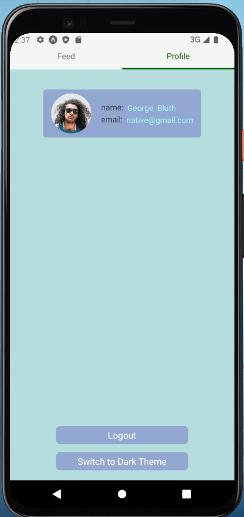

# NativePicViewer

## Опис проєкту

Додаток створено з використанням **React Native** та **TypeScript**. Він містить три основні екрани:

- **Екран аутентифікації** — забезпечує реєстрацію/вхід користувача з валідацією.
- **Екран стрічки (Feed)** — реалізує infinite scroll та pull-to-refresh функціонал.
- **Екран профілю** — відображає інформацію про користувача, дозволяє змінювати тему (light/dark) та виходити з облікового запису.

Для роботи з навігацією використовується **React Navigation**, а для управління станом — **Redux**.

---

## Функціонал

### 1. Аутентифікація

- Поля для введення `email` та `password` з валідацією:
  - **Email**: обов'язкове поле, перевірка на валідність.
  - **Password**: обов'язкове поле, мінімальна довжина — 8 символів.
- Якщо користувач уже авторизований, його автоматично перенаправляє на головну сторінку.
- Сесія користувача зберігається навіть після закриття додатка.

**API:** [reqres.in](https://reqres.in)  
**Приклад екрану:**  


---

### 2. Feed сторінка

- **Частина top tab navigation**.
- Відображає картки зображень із заголовками.

**Реалізовано:**

- **Infinite scroll** для довантаження нових даних.
- **Pull-to-refresh** для оновлення стрічки.

**Джерело даних:** [picsum.photos API](https://picsum.photos)  
**Приклад екрану:**  


---

### 3. Сторінка профілю

- **Частина top tab navigation**.
- Відображає:
  - Ім'я користувача.
  - Аватар (отримується з [reqres.in](https://reqres.in)).
  - Кнопку для перемикання теми (light/dark).
- **Кнопка виходу**, яка:
  - Виводить користувача із системи.
  - Повертає його на екран аутентифікації.
  - Забороняє повернення на сторінку профілю після виходу.

**Приклад екрану:**  


---

## Стек технологій

- **React Native** — основний фреймворк для розробки мобільних додатків.
- **TypeScript** — забезпечує типізацію для зменшення помилок у коді.
- **React Navigation** — реалізація таб-навігації.
- **Redux** — для управління станом.

### Бібліотеки:

- `react-hook-form` + `yup` — для валідації форм.
- `axios` — для роботи з API.

### API:

- [picsum.photos](https://picsum.photos) — для отримання зображень.
- [reqres.in](https://reqres.in) — для роботи з даними користувачів.

---

## Встановлення та запуск

1. Клонуйте репозиторій:

   ```bash
   git clone https://github.com/KaratSergio/NativePicViewer.git
   cd NativePicViewer

   ```

2. Встановіть залежності:
   npm install
   Запустіть додаток на емуляторі або фізичному пристрої:

   npm start # Для Android

## Структура проєкту

```
assets/                      # Зображення та медіафайли
│   ├── screen_1.png         # Екран аутентифікації
│   ├── screen_2.png         # Feed сторінка
│   └── screen_3.png         # Сторінка профілю
src/
├── app/                     # Головний файл додатку
│   └── App.tsx
├── components/              # Повторно використовувані компоненти
│   ├── FeedCard.tsx
│   └── InputField.tsx
├── navigation/              # Налаштування навігації
│   ├── MainNavigator.tsx
│   ├── RootNavigator.tsx
│   └── types.ts
├── screens/                 # Екрани додатку
│   ├── LoginScreen.tsx
│   ├── FeedScreen.tsx
│   └── ProfileScreen.tsx
├── store/                   # Логіка стейт-менеджменту
│   ├── selectors/
│   ├── services/
│   ├── slices/
│   └── store.ts
├── hooks/                   # Кастомні хуки
│   └── reduxHooks.ts
├── schemas/                 # Схеми валідації
│   └── validationSchema.ts
└── theme/                   # Тема додатку
    └── themeContext.ts
```

Подальші плани
-Реалізувати функціонал для зміни аватару користувача.
-Додати підтримку локалізації (i18n).
-Оптимізувати роботу з API за допомогою кешування даних.

Автор
[Sergio]
[safonov.json@gmail.com]
